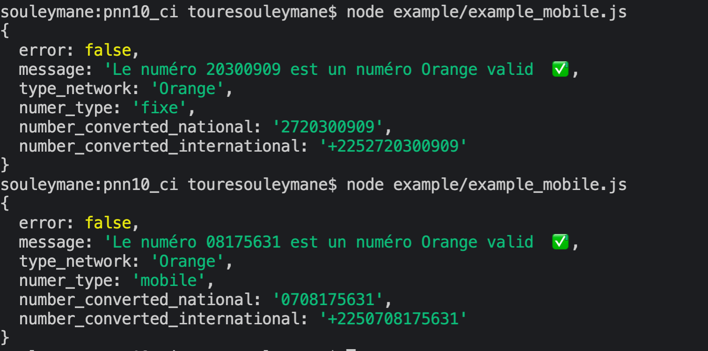

## PNN10

###  Require the module 

<code>
const pnn10 =  require("./index");
</code>

**** 

### Mobile phone number  (with - or . or space) :

The number can be this format (and variations with . or , or - space)

- xxxxxxxx
- +225xxxxxxxx
- (+225)xxxxxxxx
- (00225)xxxxxxxx
 
 
  
- xx.xx.xx.xx
- (+225)xx.xx.xx.xx
- +225xx.xx.xx.xx
 
 

- xx xx xx xx
- (+225)xx xx xx xx
- +225 xx xx xx xx
  
NB 📣 : all of this number ⬆️ work with space or . or - or , 

<code>
    var number = "(+225) 44 17 56 31";
</code>
 
 

<code>
    var converted_mobile_number = pnn10.phone_number(number);
     
     
    console.log(converted_mobile_number);
</code>
 
 

### Fixe number (with - or . or space) :

The number can be this format (and variations with . or , or - space)

- xxxxxxxx
- +225xxxxxxxx
- (+225)xxxxxxxx
- (00225)xxxxxxxx
 
 
  
- xx.xx.xx.xx
- (+225)xx.xx.xx.xx
- +225xx.xx.xx.xx
 
 

- xx xx xx xx
- (+225)xx xx xx xx
- +225 xx xx xx xx
  
NB 📣 : all of this number ⬆️ work with space or . or - or , 

<code>
    var user_fixe_number = "20 30 09 09";
</code>
 

<code>
var converted_fixe_number =  pnn10.fixe_number(user_fixe_number);
 
 
console.log(converted_fixe_number);
</code>`

 
 

### For both fixe number Or mobile Number (with - or . or space) :

The number can be this format (and variations with . or , or - space)

- xxxxxxxx
- +225xxxxxxxx
- (+225)xxxxxxxx
- (00225)xxxxxxxx
 
 
  
- xx.xx.xx.xx
- (+225)xx.xx.xx.xx
- +225xx.xx.xx.xx
 
 

- xx xx xx xx
- (+225)xx xx xx xx
- +225 xx xx xx xx
  
NB 📣 : all of this number ⬆️ work with space or . or - or , 

<code>
    var unknow_type_number = "20 30 09 09";
</code>
 

<code>
var converted_both_phone_number_fixe_number =  pnn10.both_phone_number_fixe_number(unknow_type_number);
 
 
console.log(converted_both_phone_number_fixe_number);
</code>

 

## Example 

 
 
 

### How to do : 

